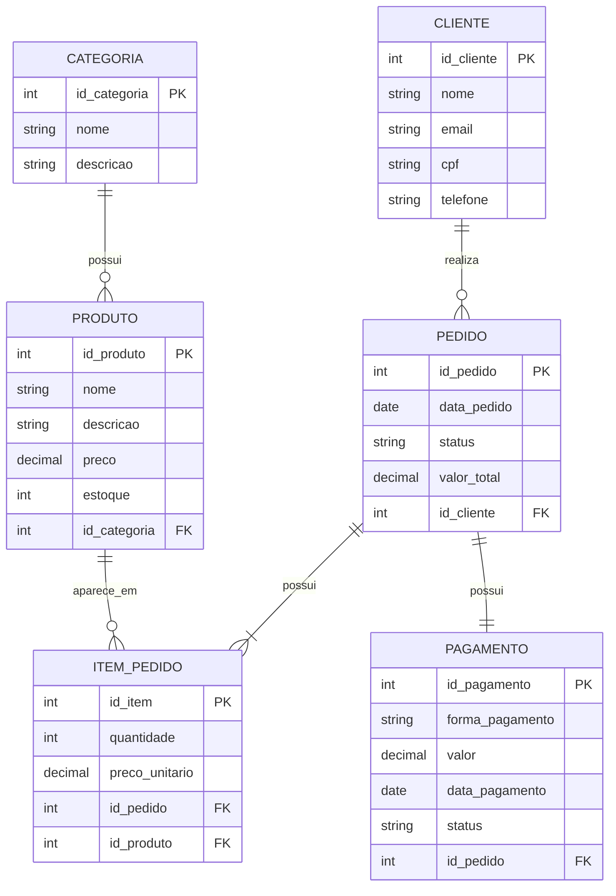

 Modelo Entidade e Relacionamento (MER)

 1. Entidades

 Cliente

 Definição: Representa as pessoas cadastradas no sistema que realizam compras na loja virtual.

 Produto

 Definição: Representa os produtos disponíveis para venda no e-commerce.

 Categoria

 Definição: Representa a classificação dos produtos, permitindo organizá-los em diferentes categorias.

 Pedido

 Definição: Representa uma compra realizada por um cliente no sistema.

 ItemPedido

 Definição: Representa cada produto incluído em um pedido, armazenando a quantidade e o preço unitário do produto no momento da compra.

 Pagamento

 Definição: Representa o pagamento associado a um pedido realizado pelo cliente.

 2. Relacionamentos e Cardinalidades

 Cliente e Pedido

**Sintaxe:** [Cliente] (1) realiza (N) [Pedido]

**Explicação:** Um cliente pode realizar vários pedidos, mas cada pedido pertence a apenas um cliente.

 Pedido e ItemPedido

**Sintaxe:** [Pedido] (1) possui (N) [ItemPedido]

**Explicação:** Um pedido possui um ou vários itens, enquanto cada item de pedido pertence a apenas um pedido.

 Produto e ItemPedido

**Sintaxe:** [Produto] (1) aparece em (N) [ItemPedido]

**Explicação:** Um produto pode aparecer em vários itens de pedidos diferentes, enquanto cada item de pedido está relacionado a apenas um produto.

 Categoria e Produto

**Sintaxe:** [Categoria] (1) possui (N) [Produto]

**Explicação:** Uma categoria pode possuir vários produtos, mas cada produto pertence a apenas uma categoria.

 Pedido e Pagamento

**Sintaxe:** [Pedido] (1) possui (1) [Pagamento]

**Explicação:** Cada pedido possui um pagamento associado, e cada pagamento está relacionado a apenas um pedido.

---

 3. Sugestão de Atributos

 Cliente

* `id_cliente` — **PK**
* `nome`
* `email`
* `cpf`
* `telefone`

 Produto

* `id_produto` — **PK**
* `nome`
* `descricao`
* `preco`
* `estoque`
* `id_categoria` — **FK**

 Categoria

* `id_categoria` — **PK**
* `nome`
* `descricao`

 Pedido

* `id_pedido` — **PK**
* `data_pedido`
* `status`
* `valor_total`
* `id_cliente` — **FK**

 ItemPedido

* `id_item` — **PK**
* `quantidade`
* `preco_unitario`
* `id_pedido` — **FK**
* `id_produto` — **FK**

 Pagamento

* `id_pagamento` — **PK**
* `forma_pagamento`
* `valor`
* `data_pagamento`
* `status`
* `id_pedido` — **FK**

 Legenda

* **PK:** Chave Primária, utilizada para identificar unicamente um registro.
* **FK:** Chave Estrangeira, utilizada para estabelecer um relacionamento entre entidades.

Não foram utilizados atributos compostos, multivalorados ou derivados neste modelo conceitual.

 4. Diagrama Entidade e Relacionamento (DER)

